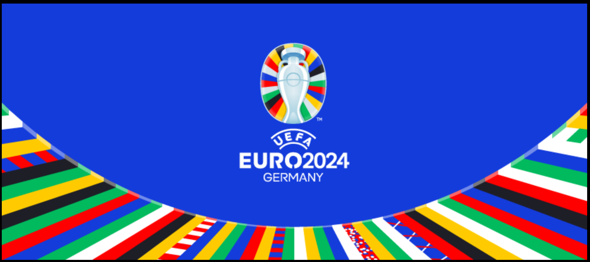

-------------------------------

# Today's Schmeichel(s):
- lea bo with 15.0 points part of Next11 [see their predictions](./pages/lea_bo.html)

# European Sperm Bank
 

 

 

 
## European Sperm Bank participants:
- [Signe Æb](./pages/Signe_Æb.html)
- [Silje Br](./pages/Silje_Br.html)
- [Lukas Ha](./pages/Lukas_Ha.html)
- [Lennart Me](./pages/Lennart_Me.html)
- [Stinne Bi](./pages/Stinne_Bi.html)
- [Steffen Jø](./pages/Steffen_Jø.html)
- [Petrica Ju](./pages/Petrica_Ju.html)
- [Jeanett Ja](./pages/Jeanett_Ja.html)
- [Mads To](./pages/Mads_To.html)
- [Mikkel  Di](./pages/Mikkel__Di.html)
- [Emma Hu](./pages/Emma_Hu.html)
- [Christina Br](./pages/Christina_Br.html)
- [Ale Mo](./pages/Ale_Mo.html)
- [Stinne Ra](./pages/Stinne_Ra.html)
- [Bart He](./pages/Bart_He.html)
- [Morten Sa](./pages/Morten_Sa.html)
- [Hiroshi Hi](./pages/Hiroshi_Hi.html)
- [Pernille Li](./pages/Pernille_Li.html)
- [Kseniia Sv](./pages/Kseniia_Sv.html)
- [Bettina Ag](./pages/Bettina_Ag.html)
- [Emma Fa](./pages/Emma_Fa.html)
- [Lars "Winner" Br](./pages/Lars__Winner__Br.html)
- [Julie Aa](./pages/Julie_Aa.html)
- [IT  Or](./pages/IT__Or.html)
- [Jonas  Co](./pages/Jonas__Co.html)
- [Luhin Ak](./pages/Luhin_Ak.html)
- [Carine Pl](./pages/Carine_Pl.html)
- [Anne Hv](./pages/Anne_Hv.html)

-----------
 
# Frederiksborg Gymnasium
 

 

 

 
## Frederiksborg Gymnasium participants:
- [Alan Ce](./pages/Alan_Ce.html)
- [Sebastian Le](./pages/Sebastian_Le.html)
- [Sarah Gy](./pages/Sarah_Gy.html)
- [Matias BN](./pages/Matias_BN.html)
- [Christian Gr](./pages/Christian_Gr.html)
- [Oscar En](./pages/Oscar_En.html)
- [Bjarke Ha](./pages/Bjarke_Ha.html)
- [Sif Ma](./pages/Sif_Ma.html)
- [Helene Cl](./pages/Helene_Cl.html)

-----------
 
# Next11
 

 

 

 
## Next11 participants:
- [Martin Ba](./pages/Martin_Ba.html)
- [Maren St](./pages/Maren_St.html)
- [Jakob Ve](./pages/Jakob_Ve.html)
- [Mathas Po](./pages/Mathas_Po.html)
- [Christian Gr](./pages/Christian_Gr.html)
- [RIKKE GR](./pages/RIKKE_GR.html)
- [lea bo](./pages/lea_bo.html)
- [Andreas Ku](./pages/Andreas_Ku.html)
- [Salty Gu](./pages/Salty_Gu.html)

-----------
 
# Friends and Family
 

 

 

 
## Friends and Family participants:
- [Kenneth Sc](./pages/Kenneth_Sc.html)
- [Laurits Pi](./pages/Laurits_Pi.html)
- [Ernst  Bø](./pages/Ernst__Bø.html)
- [Mette Is](./pages/Mette_Is.html)
- [Christian Is](./pages/Christian_Is.html)
- [Jonas Bo](./pages/Jonas_Bo.html)
- [Tobias Bo](./pages/Tobias_Bo.html)
- [Christian Gr](./pages/Christian_Gr.html)
- [Oscar Kh](./pages/Oscar_Kh.html)
- [Isabella Is](./pages/Isabella_Is.html)
- [Frederik Ha](./pages/Frederik_Ha.html)
- [CamJams Gr](./pages/CamJams_Gr.html)
- [Ebbe Ottar Je](./pages/Ebbe_Ottar_Je.html)
- [Joachim Gl](./pages/Joachim_Gl.html)

-----------
 
# Quantum and Laser Photonics DTU
 

 

 

 
## Quantum and Laser Photonics DTU participants:
- [Matias BN](./pages/Matias_BN.html)
- [Mattias Ra](./pages/Mattias_Ra.html)
- [Simon Bo](./pages/Simon_Bo.html)
- [Kristian Se](./pages/Kristian_Se.html)
- [Jesper Mø](./pages/Jesper_Mø.html)
- [Ayman Ka](./pages/Ayman_Ka.html)

-----------
 
# GeH Fys
 

 

 

 
## GeH Fys participants:
- [Tobias Hø](./pages/Tobias_Hø.html)
- [Regitze Ar](./pages/Regitze_Ar.html)
- [Thomas Pe](./pages/Thomas_Pe.html)
- [Rasmus  Kj](./pages/Rasmus__Kj.html)
- [Line Bi](./pages/Line_Bi.html)
- [mathilde  ho](./pages/mathilde__ho.html)
- [Christine Jo](./pages/Christine_Jo.html)
- [Andreas An](./pages/Andreas_An.html)
- [Marianne Ol](./pages/Marianne_Ol.html)
- [Bjarke Ha](./pages/Bjarke_Ha.html)
- [Bob Ju](./pages/Bob_Ju.html)
- [Marianne Æg](./pages/Marianne_Æg.html)
- [Mathias  Th](./pages/Mathias__Th.html)
- [Lisbeth Ul](./pages/Lisbeth_Ul.html)
- [Hanne Ho](./pages/Hanne_Ho.html)

-----------
 
